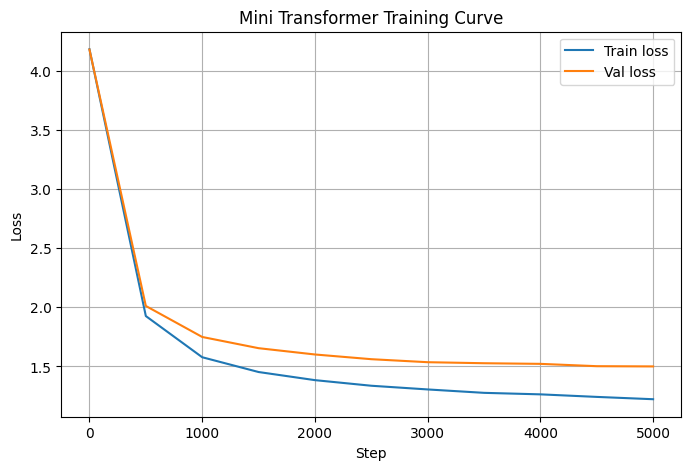

# Metrics — Logos v0.1-alpha

## Model

| Component | Detail |
|---|---|
| Type | Decoder-only Transformer |
| Tokenizer | Character-level |
| Vocab size | 65 |
| Embedding dim | 192 |
| Attention heads | 6 |
| Layers | 6 |
| Context length | 128 |
| Batch size | 64 |
| Dropout | 0.2 |
| Total parameters | 2,715,713 |

## Training

| Setting | Value |
|---|---|
| Dataset | Tiny Shakespeare (1,115,394 chars) |
| Train / Val split | 90% / 10% |
| Optimizer | AdamW |
| Learning rate | 3e-4 (fixed) |
| Gradient clipping | None |
| LR scheduler | None |
| Checkpointing | None (final step saved) |
| Iterations | 5,000 |
| Hardware | CPU (Kaggle) |
| Training time | ~295 minutes |

## Loss Curve

| Step | Train loss | Val loss |
|---|---|---|
| 0 | 4.1834 | 4.1805 |
| 500 | 1.9262 | 2.0115 |
| 1000 | 1.5777 | 1.7492 |
| 1500 | 1.4526 | 1.6543 |
| 2000 | 1.3840 | 1.6010 |
| 2500 | 1.3366 | 1.5612 |
| 3000 | 1.3053 | 1.5357 |
| 3500 | 1.2765 | 1.5270 |
| 4000 | 1.2637 | 1.5217 |
| 4500 | 1.2422 | 1.5020 |
| 4999 | 1.2226 | 1.5001 |

## Final Results

| Metric | Value |
|---|---|
| Train loss | **1.2218** |
| Val loss | **1.4996** |
| Train perplexity | **3.39** |
| Val perplexity | **4.48** |

## Generation

| Setting | Value |
|---|---|
| Tokens generated | 500 |
| Sampling | Greedy multinomial (no temperature / top-k) |

See `sample_output.txt` for the generated text.