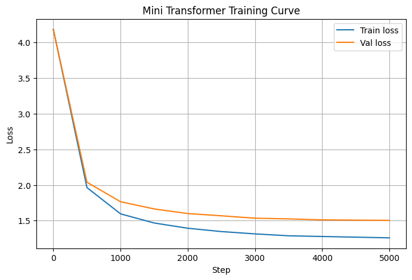

# Metrics — Logos v0.2-alpha

## Model

| Component | Detail |
|---|---|
| Type | Decoder-only Transformer |
| Tokenizer | Character-level |
| Vocab size | 65 |
| Embedding dim | 192 |
| Attention heads | 6 |
| Layers | 6 |
| Context length | 128 |
| Batch size | 64 |
| Dropout | 0.2 |
| Total parameters | 2,715,713 |

## Training

| Setting | Value |
|---|---|
| Dataset | Tiny Shakespeare (1,115,394 chars) |
| Train / Val split | 90% / 10% |
| Optimizer | AdamW |
| Learning rate | 3e-4 (cosine decay → 5% of base lr) |
| LR warmup | 100 steps (linear) |
| Gradient clipping | 1.0 (max norm) |
| Checkpointing | Best val loss checkpoint saved |
| Iterations | 5,000 |
| Hardware | CPU (Kaggle) |

## Loss Curve

## Final Results

| Metric | Value |
|---|---|
| Train loss | **1.2607** |
| Val loss | **1.5055** |
| Train perplexity | **3.53** |
| Val perplexity | **4.51** |
| Best val loss (checkpoint) | **1.5042** at step 4999 |

> The metrics are marginally different from v0.1 because the cosine LR schedule with warmup
> changes learning dynamics — the runs are not directly comparable.

## Generation

| Setting | Value |
|---|---|
| Tokens generated | 500 |
| Temperature | 0.9 |
| Top-k | 40 |

See `sample_output.txt` for the generated text.