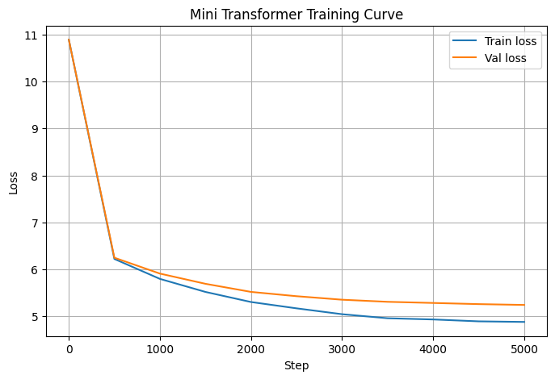

# Metrics — Logos v0.3-alpha

## Model

| Component | Detail |
|---|---|
| Type | Decoder-only Transformer |
| Tokenizer | GPT-2 BPE (via tiktoken) |
| Vocab size | 50,257 |
| Embedding dim | 256 |
| Attention heads | 8 |
| Layers | 8 |
| Context length | 256 |
| Batch size | 32 |
| Dropout | 0.2 |
| Total parameters | 32,159,825 |

## Training

| Setting | Value |
|---|---|
| Dataset | OpenWebText (8,000 samples) |
| Dataset size | 38,810,810 characters / 8,876,419 tokens |
| Train / Val split | 90% / 10% |
| Train tokens | 7,988,777 |
| Val tokens | 887,642 |
| Optimizer | AdamW |
| Learning rate | 3e-4 (cosine decay → 5% of base lr) |
| LR warmup | 100 steps (linear) |
| Gradient clipping | 1.0 (max norm) |
| Mixed precision | torch.amp.autocast + GradScaler |
| Checkpointing | Best val loss checkpoint saved |
| Iterations | 5,000 |
| Hardware | GPU P100 (Kaggle) |

## Loss Curve

| Step | Train loss | Val loss |
|---|---|---|
| 0 | 10.8925 | 10.8915 |
| 500 | 6.2215 | 6.2482 |
| 1000 | 5.7970 | 5.9099 |
| 1500 | 5.5192 | 5.6923 |
| 2000 | 5.3043 | 5.5198 |
| 2500 | 5.1696 | 5.4282 |
| 3000 | 5.0447 | 5.3534 |
| 3500 | 4.9584 | 5.3086 |
| 4000 | 4.9326 | 5.2842 |
| 4500 | 4.8925 | 5.2595 |
| 4999 | 4.8801 | 5.2422 |

## Final Results

| Metric | Value |
|---|---|
| Train loss | **4.8780** |
| Val loss | **5.2579** |
| Train perplexity | **131.36** |
| Val perplexity | **192.08** |
| Best val loss (checkpoint) | **5.2422** at step 4999 |

> Metrics are not directly comparable to v0.1 or v0.2. The tokenizer changed
> from character-level (65 tokens) to GPT-2 BPE (50,257 tokens) - the
> dataset changed from Tiny Shakespeare to OpenWebText. Perplexity is computed
> over a 50,257-token vocabulary on diverse real-world text — a fundamentally
> harder task.

## Generation

| Setting | Value |
|---|---|
| Tokens generated | 500 |
| Temperature | 0.9 |
| Top-k | 40 |
| Top-p | 0.9 |

See `sample_output.txt` for the generated text.